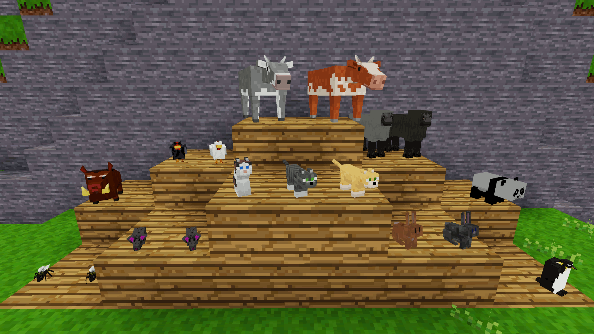

# minetest mod mobs_jam

IT add animals for farmin like cows, dogs chicken or cats.

## Information

This mod is forked to improve compatibility backguard for 0.4 engine. It also provides some new translatins and ajustments

### Depends

* mobs
* default

Optionally

* intlib
* lucky_blocks

## Animals:

### Bee
Tends to buzz around flowers and gives honey when killed, you can also right-click a bee to pick it up and place in inventory. 3x bee's in a row can craft a beehive.

---
### Bunny
Bunnies appear in green grass areas (prairie biome in ethereal) and can be tamed with 4 carrots or grass. Can also be picked up and placed in inventory and gives 1 raw rabbit and 1 rabbit hide when killed.

---
### Chicken
Found in green areas (bamboo biome in ethereal) and lays eggs on flat ground, Can be picked up and placed in inventory and gives 1-2 raw chicken when killed. Feed 8x wheat seed to breed.

---
### Cow
Wanders around eating grass/wheat and can be right-clicked with empty bucket to get milk. Cows will defend themselves when hit and can be right-clicked with 8x wheat to tame and breed.

---
### Kitten
Found on green grass these cute cats walk around and can be picked up and placed in inventory as pets or right-clicked with 4x live rats or raw fish (found in ethereal) and tamed.  They can sometimes leave you little gifts of a hairball.

---
### Rat
Typically found around stone they can be picked up and cooked for eating.

---
### Sheep
Green grass and wheat munchers that can be clipped using shears to give 1-3 wool when tamed. Feed sheep 8x wheat to regrow wool, tame and breed.  Right-click a tamed sheep with dye to change it's colour.  Will drop 1-3 raw mutton when killed.

---
### Warthog
Warthogs unlike pigs defend themselves when hit and give 1-3 raw pork when killed, they can also be right-clicked with 8x apples to tame or breed.

---
### Penguin
These little guys can be found in glacier biomes on top of snow and have the ability to swim if they fall into water.

---
### Panda
These monochrome cuties spawn in Ethereal's bamboo biome and can be tamed with bamboo stalks :)  Remember they have claws though.

---
*Note: After breeding, animals need to rest for 4 minutes and baby animals take 4 minutes to grow up, also feeding them helps them grow quicker...*

### tortoise
These were extracted from dmobs mod from D00Med and its friendly but pretty slowww

### Owl
These were extracted from dmobs mod and spawns at the leaves or trees, will rest at night and at day will hide

### Fox
These were extracted from dmobs mod, its aggressive and will not leave you from attack

### Fire Spirit

Fire Spirits will not tolerate players roaming around their domain and will fiercely attack until their dying puff of smoke. Th
ey will drop their spirit and some fire dust when using ethereal.

#### Lucky Blocks: 20
